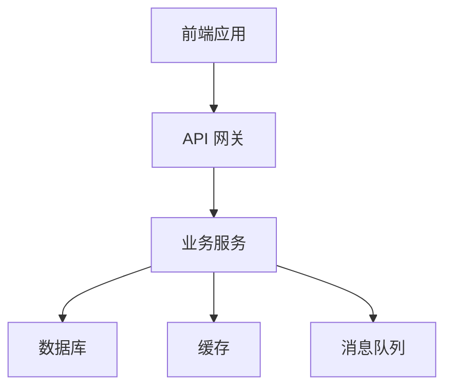

## 用户输入

```text
$ARGUMENTS
```

你必须考虑用户输入后再继续（如果不为空）。

## 概述

技术计划命令将功能规范转换为详细的技术实现方案。这个命令会：

1. **规范分析**：理解功能需求和技术约束
2. **技术选型**：基于用户输入和项目宪法选择技术栈
3. **架构设计**：设计系统架构和数据模型
4. **实现规划**：制定详细的实现步骤

## 执行流程

### 1. 上下文加载
- 读取功能规范：`_sdd/specs/[feature-name]/spec.md`
- 读取项目宪法：`_sdd/memory/constitution.md`
- 检查现有技术计划：`plan.md`

### 2. 技术上下文分析
基于功能规范和宪法分析：

#### 必需技术
- **前端框架**：根据宪法要求
- **后端框架**：根据宪法要求
- **数据库**：根据数据需求
- **缓存系统**：根据性能要求

#### 待澄清技术
标记为 `NEEDS CLARIFICATION`：
- [ ] 具体的技术版本选择
- [ ] 第三方服务集成
- [ ] 部署环境配置
- [ ] 性能优化策略

### 3. 宪法合规性检查
验证技术选择符合项目宪法：
- [ ] **技术约束**：必须使用/禁止的技术
- [ ] **性能要求**：响应时间、并发量
- [ ] **安全要求**：认证、授权、数据保护
- [ ] **开发规范**：测试覆盖率、代码质量

### 4. 技术选型决策

#### 前端技术栈
基于用户输入和功能需求：
- **UI 框架**：React/Vue/Angular（根据宪法）
- **状态管理**：Redux/Vuex/MobX
- **路由管理**：React Router/Vue Router
- **UI 组件库**：Material-UI/Ant Design/Chakra UI

#### 后端技术栈
- **Web 框架**：Express/FastAPI/Django（根据宪法）
- **ORM 框架**：Prisma/SQLAlchemy/TypeORM
- **认证库**：JWT/OAuth2/Passport.js
- **验证库**：Joi/Yup/Pydantic

#### 数据存储
- **主数据库**：PostgreSQL/MySQL/MongoDB
- **缓存**：Redis/Memcached
- **文件存储**：AWS S3/本地存储

### 5. 架构设计

#### 系统架构


#### 数据模型设计
基于功能规范中的实体：
- 定义数据表结构
- 设计关系映射
- 确定索引策略
- 制定约束规则

#### API 设计
- RESTful API 端点设计
- 请求/响应格式定义
- 错误处理策略
- API 版本管理

### 6. 安全设计
- **认证方案**：JWT/OAuth2/Session
- **授权模型**：RBAC/ABAC
- **数据保护**：加密、脱敏
- **安全防护**：输入验证、SQL注入防护

### 7. 性能优化
- **数据库优化**：查询优化、索引策略
- **缓存策略**：多级缓存、失效策略
- **前端优化**：代码分割、懒加载

### 8. 测试策略
- **单元测试**：覆盖率要求、测试框架
- **集成测试**：API 测试、数据库测试
- **端到端测试**：用户场景测试

### 9. 部署策略
- **环境配置**：开发、测试、生产环境
- **CI/CD 流程**：自动化构建、测试、部署
- **监控告警**：性能监控、错误追踪

## 输出格式

### 成功输出
```markdown
# 🏗️ 技术计划制定完成

## 计划信息
- **功能名称**: user-authentication
- **计划文件**: `_sdd/specs/user-authentication/plan.md`
- **创建日期**: 2024-01-01
- **技术负责人**: [技术负责人]

## 技术栈
- **前端**: React 18 + TypeScript + Tailwind CSS
- **后端**: Node.js + Express + TypeScript
- **数据库**: PostgreSQL 14
- **缓存**: Redis 6
- **认证**: JWT + bcrypt

## 架构概览
```
前端应用 → API 网关 → 认证服务 → 数据库
                ↓
              Redis 缓存
```

## 数据模型
### User 表
- id: UUID (主键)
- email: VARCHAR(255) (唯一)
- password_hash: VARCHAR(255)
- created_at: TIMESTAMP
- updated_at: TIMESTAMP

## API 端点
- `POST /api/auth/login` - 用户登录
- `POST /api/auth/register` - 用户注册
- `POST /api/auth/logout` - 用户登出
- `GET /api/auth/profile` - 获取用户信息

## 安全设计
- **认证**: JWT Token (有效期 24h)
- **密码**: bcrypt 加密 (salt rounds: 12)
- **API 限流**: 每分钟最多 10 次请求

## 性能目标
- **登录响应时间**: < 200ms
- **并发用户**: 1000+
- **数据库查询**: < 50ms

## 测试策略
- **单元测试覆盖率**: 90%+
- **集成测试**: 所有 API 端点
- **E2E 测试**: 关键用户流程

## 宪法合规性
- ✅ 使用宪法规定的技术栈
- ✅ 满足性能要求
- ✅ 符合安全标准
- ✅ 遵循开发规范

## 生成文档
- ✅ `data-model.md` - 数据模型设计
- ✅ `contracts/` - API 契约定义
- ✅ `research.md` - 技术调研结果
- ✅ `quickstart.md` - 快速验证指南

## 下一步建议
1. 使用 `/sdd.tasks` 分解开发任务
2. 使用 `/sdd.implement` 开始实现
3. 使用 `/sdd.checklist` 生成质量检查清单
```

### 需要澄清的输出
```markdown
# ❓ 技术选择需要澄清

## 发现的技术问题
在制定技术计划时发现以下需要澄清的问题：

### 问题 1: 数据库选择
**上下文**: 用户认证功能需要存储用户信息
**需要知道**: 使用哪种数据库？

**建议选项**:
| 选项 | 数据库 | 优缺点 |
|------|--------|--------|
| A | PostgreSQL | 功能强大，支持复杂查询 |
| B | MySQL | 性能优秀，生态成熟 |
| C | MongoDB | 灵活文档存储，开发快速 |

**你的选择**: _[等待用户回复]_

### 问题 2: 缓存策略
**上下文**: 登录状态需要缓存
**需要知道**: 使用什么缓存方案？

**建议选项**:
| 选项 | 缓存方案 | 优缺点 |
|------|----------|--------|
| A | Redis 内存缓存 | 性能最好，需要额外服务 |
| B | JWT 无状态 | 简单实现，无法主动失效 |
| C | 数据库会话 | 简单可靠，性能较差 |

**你的选择**: _[等待用户回复]_
```

## 使用示例

### 基本技术计划
```bash
/sdd.plan 使用 React 和 Node.js，PostgreSQL 数据库
```

### 详细技术计划
```bash
/sdd.plan 前端使用 React 18 + TypeScript + Tailwind CSS，后端使用 Node.js + Express + TypeScript，数据库使用 PostgreSQL，缓存使用 Redis，认证使用 JWT
```

### 更新现有计划
```bash
/sdd.plan 更新认证方案，增加 OAuth2 第三方登录
```

## 注意事项

1. **严格遵循宪法**，技术选择不能违反宪法约束
2. **考虑性能要求**，选择合适的技术和架构
3. **重视安全性**，设计完善的认证授权机制
4. **保持可扩展性**，为未来功能扩展留有余地
5. **文档完整性**，生成所有必要的设计文档

## 相关命令

- `/sdd.specify` - 创建功能规范
- `/sdd.tasks` - 分解开发任务
- `/sdd.implement` - 执行实现
- `/sdd.analyze` - 分析一致性