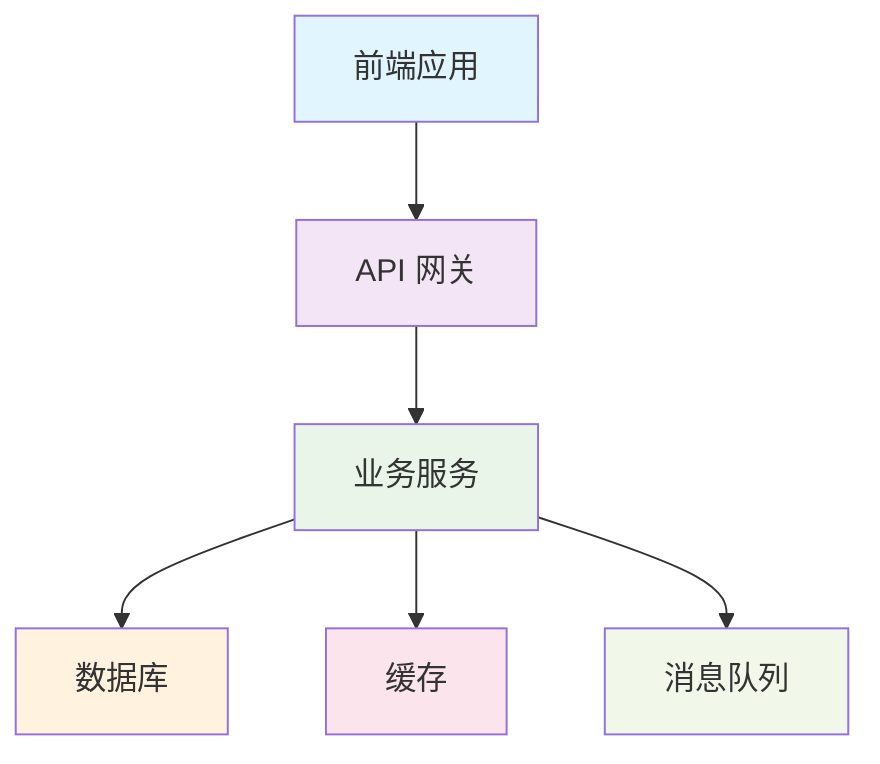

# [FEATURE_NAME] 技术实现计划

## 基本信息
- **功能编号**: [FEATURE_ID]
- **创建日期**: [CREATION_DATE]
- **最后修订**: [LAST_REVISION_DATE]
- **技术负责人**: [TECH_LEAD]
- **状态**: [DRAFT/IN_REVIEW/APPROVED/IMPLEMENTED]

---

## 技术上下文

### 项目技术栈
- **前端框架**: [FRONTEND_FRAMEWORK]
- **后端框架**: [BACKEND_FRAMEWORK]
- **数据库**: [DATABASE_TYPE]
- **缓存**: [CACHE_SYSTEM]
- **消息队列**: [MESSAGE_QUEUE]
- **部署平台**: [DEPLOYMENT_PLATFORM]

### 相关系统
- **依赖系统**: [DEPENDENT_SYSTEMS]
- **集成系统**: [INTEGRATED_SYSTEMS]
- **影响范围**: [IMPACT_SCOPE]

---

## 宪法合规性检查

### 核心原则验证
- [ ] **原则 1**: [PRINCIPLE_1_COMPLIANCE_CHECK]
- [ ] **原则 2**: [PRINCIPLE_2_COMPLIANCE_CHECK]
- [ ] **原则 3**: [PRINCIPLE_3_COMPLIANCE_CHECK]

### 技术约束验证
- [ ] **必须使用的技术**: [REQUIRED_TECH_COMPLIANCE]
- [ ] **禁止使用的技术**: [FORBIDDEN_TECH_COMPLIANCE]
- [ ] **性能要求**: [PERFORMANCE_COMPLIANCE]
- [ ] **安全要求**: [SECURITY_COMPLIANCE]

### 开发规范验证
- [ ] **代码质量标准**: [CODE_QUALITY_COMPLIANCE]
- [ ] **测试覆盖率**: [TEST_COVERAGE_COMPLIANCE]
- [ ] **文档要求**: [DOCUMENTATION_COMPLIANCE]

---

## 架构设计

### 系统架构图


### 组件设计
- **前端组件**: [FRONTEND_COMPONENTS]
- **后端服务**: [BACKEND_SERVICES]
- **数据访问层**: [DATA_ACCESS_LAYER]
- **业务逻辑层**: [BUSINESS_LOGIC_LAYER]

### 数据流设计
[DATA_FLOW_DESIGN]

---

## 技术选型

### 前端技术
- **UI 组件库**: [UI_LIBRARY]
- **状态管理**: [STATE_MANAGEMENT]
- **路由管理**: [ROUTING_LIBRARY]
- **HTTP 客户端**: [HTTP_CLIENT]
- **构建工具**: [BUILD_TOOL]

### 后端技术
- **Web 框架**: [WEB_FRAMEWORK]
- **ORM 框架**: [ORM_FRAMEWORK]
- **认证授权**: [AUTH_LIBRARY]
- **验证框架**: [VALIDATION_LIBRARY]
- **日志框架**: [LOGGING_LIBRARY]

### 数据存储
- **主数据库**: [PRIMARY_DATABASE]
- **缓存数据库**: [CACHE_DATABASE]
- **文件存储**: [FILE_STORAGE]
- **搜索引擎**: [SEARCH_ENGINE]

### 基础设施
- **容器化**: [CONTAINER_PLATFORM]
- **编排工具**: [ORCHESTRATION_TOOL]
- **监控工具**: [MONITORING_TOOL]
- **日志收集**: [LOG_COLLECTION]

---

## 数据模型设计

### 核心实体关系图
```mermaid
erDiagram
    ENTITY_1 {
        id PK
        attribute_1
        attribute_2
        created_at
        updated_at
    }
    
    ENTITY_2 {
        id PK
        attribute_1
        attribute_2
        entity_1_id FK
        created_at
        updated_at
    }
    
    ENTITY_1 ||--o{ ENTITY_2 : "has many"
```

### 数据库表结构

#### 表 1: [TABLE_1_NAME]
```sql
CREATE TABLE [TABLE_1_NAME] (
    [COLUMN_1_NAME] [DATA_TYPE] [CONSTRAINTS],
    [COLUMN_2_NAME] [DATA_TYPE] [CONSTRAINTS],
    created_at TIMESTAMP DEFAULT CURRENT_TIMESTAMP,
    updated_at TIMESTAMP DEFAULT CURRENT_TIMESTAMP ON UPDATE CURRENT_TIMESTAMP,
    PRIMARY KEY ([PRIMARY_KEY])
);
```

**索引设计**:
- [INDEX_1]: [INDEX_1_DESCRIPTION]
- [INDEX_2]: [INDEX_2_DESCRIPTION]

**约束条件**:
- [CONSTRAINT_1]: [CONSTRAINT_1_DESCRIPTION]
- [CONSTRAINT_2]: [CONSTRAINT_2_DESCRIPTION]

---

#### 表 2: [TABLE_2_NAME]
```sql
CREATE TABLE [TABLE_2_NAME] (
    [COLUMN_1_NAME] [DATA_TYPE] [CONSTRAINTS],
    [COLUMN_2_NAME] [DATA_TYPE] [CONSTRAINTS],
    [FOREIGN_KEY_COLUMN] [DATA_TYPE] REFERENCES [REFERENCED_TABLE],
    created_at TIMESTAMP DEFAULT CURRENT_TIMESTAMP,
    updated_at TIMESTAMP DEFAULT CURRENT_TIMESTAMP ON UPDATE CURRENT_TIMESTAMP,
    PRIMARY KEY ([PRIMARY_KEY])
);
```

**索引设计**:
- [INDEX_1]: [INDEX_1_DESCRIPTION]
- [INDEX_2]: [INDEX_2_DESCRIPTION]

**约束条件**:
- [CONSTRAINT_1]: [CONSTRAINT_1_DESCRIPTION]
- [CONSTRAINT_2]: [CONSTRAINT_2_DESCRIPTION]

---

## API 设计

### RESTful API 端点

#### [API_GROUP_1] API

##### 创建 [RESOURCE]
```http
POST /api/v1/[RESOURCE_PATH]
Content-Type: application/json
Authorization: Bearer {token}

{
    "field_1": "value_1",
    "field_2": "value_2"
}
```

**响应**:
```http
201 Created
Content-Type: application/json

{
    "id": "resource_id",
    "field_1": "value_1",
    "field_2": "value_2",
    "created_at": "2024-01-01T00:00:00Z"
}
```

**错误响应**:
```http
400 Bad Request
Content-Type: application/json

{
    "error": "VALIDATION_ERROR",
    "message": "Invalid input data",
    "details": {
        "field_1": ["Field is required"]
    }
}
```

---

##### 获取 [RESOURCE] 列表
```http
GET /api/v1/[RESOURCE_PATH]?page=1&limit=20&sort=created_at&order=desc
Authorization: Bearer {token}
```

**响应**:
```http
200 OK
Content-Type: application/json

{
    "data": [
        {
            "id": "resource_id",
            "field_1": "value_1",
            "field_2": "value_2",
            "created_at": "2024-01-01T00:00:00Z"
        }
    ],
    "pagination": {
        "page": 1,
        "limit": 20,
        "total": 100,
        "total_pages": 5
    }
}
```

---

##### 获取单个 [RESOURCE]
```http
GET /api/v1/[RESOURCE_PATH]/{resource_id}
Authorization: Bearer {token}
```

**响应**:
```http
200 OK
Content-Type: application/json

{
    "id": "resource_id",
    "field_1": "value_1",
    "field_2": "value_2",
    "created_at": "2024-01-01T00:00:00Z",
    "updated_at": "2024-01-01T00:00:00Z"
}
```

---

##### 更新 [RESOURCE]
```http
PUT /api/v1/[RESOURCE_PATH]/{resource_id}
Content-Type: application/json
Authorization: Bearer {token}

{
    "field_1": "updated_value_1",
    "field_2": "updated_value_2"
}
```

**响应**:
```http
200 OK
Content-Type: application/json

{
    "id": "resource_id",
    "field_1": "updated_value_1",
    "field_2": "updated_value_2",
    "updated_at": "2024-01-01T00:00:00Z"
}
```

---

##### 删除 [RESOURCE]
```http
DELETE /api/v1/[RESOURCE_PATH]/{resource_id}
Authorization: Bearer {token}
```

**响应**:
```http
204 No Content
```

---

### WebSocket 事件（如适用）

#### 事件 1: [EVENT_1_NAME]
```javascript
// 客户端发送
{
    "type": "[EVENT_1_TYPE]",
    "data": {
        "field_1": "value_1"
    }
}

// 服务端响应
{
    "type": "[EVENT_1_RESPONSE]",
    "data": {
        "field_1": "value_1",
        "result": "success"
    }
}
```

---

## 安全设计

### 认证授权
- **认证方式**: [AUTHENTICATION_METHOD]
- **授权模型**: [AUTHORIZATION_MODEL]
- **权限控制**: [PERMISSION_CONTROL]

### 数据安全
- **数据加密**: [DATA_ENCRYPTION]
- **传输安全**: [TRANSMISSION_SECURITY]
- **存储安全**: [STORAGE_SECURITY]

### 安全防护
- **输入验证**: [INPUT_VALIDATION]
- **SQL 注入防护**: [SQL_INJECTION_PROTECTION]
- **XSS 防护**: [XSS_PROTECTION]
- **CSRF 防护**: [CSRF_PROTECTION]

---

## 性能优化

### 数据库优化
- **查询优化**: [QUERY_OPTIMIZATION]
- **索引策略**: [INDEX_STRATEGY]
- **连接池配置**: [CONNECTION_POOL_CONFIG]

### 缓存策略
- **缓存层级**: [CACHE_LAYERS]
- **缓存失效**: [CACHE_INVALIDATION]
- **缓存预热**: [CACHE_WARM_UP]

### 前端优化
- **代码分割**: [CODE_SPLITTING]
- **懒加载**: [LAZY_LOADING]
- **资源压缩**: [RESOURCE_COMPRESSION]

---

## 监控和日志

### 应用监控
- **性能指标**: [PERFORMANCE_METRICS]
- **业务指标**: [BUSINESS_METRICS]
- **错误监控**: [ERROR_MONITORING]

### 日志策略
- **日志级别**: [LOG_LEVELS]
- **日志格式**: [LOG_FORMAT]
- **日志收集**: [LOG_COLLECTION]

### 告警机制
- **告警规则**: [ALERT_RULES]
- **通知渠道**: [NOTIFICATION_CHANNELS]
- **响应流程**: [RESPONSE_PROCESS]

---

## 测试策略

### 单元测试
- **覆盖率要求**: [UNIT_TEST_COVERAGE]
- **测试框架**: [UNIT_TEST_FRAMEWORK]
- **Mock 策略**: [MOCK_STRATEGY]

### 集成测试
- **测试范围**: [INTEGRATION_TEST_SCOPE]
- **测试环境**: [INTEGRATION_TEST_ENV]
- **测试数据**: [INTEGRATION_TEST_DATA]

### 端到端测试
- **测试场景**: [E2E_TEST_SCENARIOS]
- **测试工具**: [E2E_TEST_TOOLS]
- **测试频率**: [E2E_TEST_FREQUENCY]

### 性能测试
- **负载测试**: [LOAD_TESTING]
- **压力测试**: [STRESS_TESTING]
- **基准测试**: [BENCHMARK_TESTING]

---

## 部署策略

### 环境配置
- **开发环境**: [DEV_ENVIRONMENT]
- **测试环境**: [TEST_ENVIRONMENT]
- **预生产环境**: [STAGING_ENVIRONMENT]
- **生产环境**: [PROD_ENVIRONMENT]

### 部署流程
- **构建流程**: [BUILD_PROCESS]
- **部署流程**: [DEPLOYMENT_PROCESS]
- **回滚策略**: [ROLLBACK_STRATEGY]

### 配置管理
- **配置文件**: [CONFIG_FILES]
- **环境变量**: [ENVIRONMENT_VARIABLES]
- **密钥管理**: [SECRET_MANAGEMENT]

---

## 风险评估和缓解

### 技术风险
- **风险 1**: [TECHNICAL_RISK_1]
  - **影响程度**: [IMPACT_LEVEL]
  - **缓解措施**: [MITIGATION_MEASURES]

- **风险 2**: [TECHNICAL_RISK_2]
  - **影响程度**: [IMPACT_LEVEL]
  - **缓解措施**: [MITIGATION_MEASURES]

### 业务风险
- **风险 1**: [BUSINESS_RISK_1]
  - **影响程度**: [IMPACT_LEVEL]
  - **缓解措施**: [MITIGATION_MEASURES]

---

## 实施计划

### 开发阶段
- **阶段 1**: [PHASE_1_DESCRIPTION] - [PHASE_1_DURATION]
- **阶段 2**: [PHASE_2_DESCRIPTION] - [PHASE_2_DURATION]
- **阶段 3**: [PHASE_3_DESCRIPTION] - [PHASE_3_DURATION]

### 里程碑
- **里程碑 1**: [MILESTONE_1] - [MILESTONE_1_DATE]
- **里程碑 2**: [MILESTONE_2] - [MILESTONE_2_DATE]
- **里程碑 3**: [MILESTONE_3] - [MILESTONE_3_DATE]

### 资源需求
- **开发人员**: [DEVELOPER_REQUIREMENTS]
- **测试人员**: [TESTER_REQUIREMENTS]
- **基础设施**: [INFRASTRUCTURE_REQUIREMENTS]

---

## 附录

### 技术决策记录
| 决策 | 选项 | 选择 | 理由 | 日期 |
|------|------|------|------|------|
| [DECISION_1] | [OPTION_1] | [SELECTED_OPTION] | [REASON] | [DATE] |
| [DECISION_2] | [OPTION_2] | [SELECTED_OPTION] | [REASON] | [DATE] |

### 参考文档
- [REFERENCE_DOCUMENT_1]
- [REFERENCE_DOCUMENT_2]

### 历史修订
| 版本 | 日期 | 修订内容 | 修订人 |
|------|------|----------|--------|
| [VERSION_1] | [DATE_1] | [CHANGE_1] | [AUTHOR_1] |
| [VERSION_2] | [DATE_2] | [CHANGE_2] | [AUTHOR_2] |

---

**注意**: 本技术计划必须严格遵循项目宪法的技术约束和开发规范。任何技术决策都应该有明确的理由和评估。