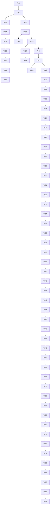

# [FEATURE_NAME] 任务清单

## 基本信息
- **功能编号**: [FEATURE_ID]
- **创建日期**: [CREATION_DATE]
- **最后修订**: [LAST_REVISION_DATE]
- **任务负责人**: [TASK_OWNER]
- **预计工期**: [ESTIMATED_DURATION]

---

## 任务概览

### 任务统计
- **总任务数**: [TOTAL_TASKS]
- **已完成**: [COMPLETED_TASKS]
- **进行中**: [IN_PROGRESS_TASKS]
- **待开始**: [PENDING_TASKS]

### 工期估算
| 阶段 | 任务数 | 预计工期 | 开始日期 | 结束日期 |
|------|--------|----------|----------|----------|
| [PHASE_1] | [PHASE_1_TASKS] | [PHASE_1_DURATION] | [PHASE_1_START] | [PHASE_1_END] |
| [PHASE_2] | [PHASE_2_TASKS] | [PHASE_2_DURATION] | [PHASE_2_START] | [PHASE_2_END] |
| [PHASE_3] | [PHASE_3_TASKS] | [PHASE_3_DURATION] | [PHASE_3_START] | [PHASE_3_END] |

---

## 执行策略

### 开发方法
- **开发模式**: [DEVELOPMENT_MODE] (TDD/BDD/传统)
- **集成策略**: [INTEGRATION_STRATEGY]
- **发布策略**: [RELEASE_STRATEGY]

### 并行执行
- **最大并行任务数**: [MAX_PARALLEL_TASKS]
- **并行规则**: [PARALLEL_EXECUTION_RULES]

### 质量保证
- **代码审查**: [CODE_REVIEW_REQUIREMENTS]
- **测试要求**: [TESTING_REQUIREMENTS]
- **验收标准**: [ACCEPTANCE_CRITERIA]

---

## 阶段 1: 项目设置

### 目标
建立项目基础结构和开发环境

### 验收标准
- [ ] 项目结构创建完成
- [ ] 开发环境配置完成
- [ ] 基础依赖安装完成
- [ ] CI/CD 流水线配置完成

### 任务列表

#### 基础设置
- [ ] T001 创建项目目录结构
  - **文件路径**: `src/`, `tests/`, `docs/`
  - **预估时间**: 30分钟
  - **依赖**: 无

- [ ] T002 初始化包管理文件
  - **文件路径**: `package.json`, `requirements.txt`, `pom.xml`
  - **预估时间**: 15分钟
  - **依赖**: T001

- [ ] T003 配置开发工具
  - **文件路径**: `.eslintrc.js`, `.prettierrc`, `pyproject.toml`
  - **预估时间**: 45分钟
  - **依赖**: T002

#### 依赖安装
- [ ] T004 安装核心框架依赖
  - **文件路径**: `package.json`, `requirements.txt`
  - **预估时间**: 20分钟
  - **依赖**: T002

- [ ] T005 安装开发工具依赖
  - **文件路径**: `package.json`, `requirements.txt`
  - **预估时间**: 15分钟
  - **依赖**: T004

- [ ] T006 [P] 配置测试框架
  - **文件路径**: `jest.config.js`, `pytest.ini`
  - **预估时间**: 30分钟
  - **依赖**: T005

#### 环境配置
- [ ] T007 创建环境配置文件
  - **文件路径**: `.env.example`, `.env.local`
  - **预估时间**: 20分钟
  - **依赖**: T003

- [ ] T008 配置数据库连接
  - **文件路径**: `src/config/database.js`, `src/config/database.py`
  - **预估时间**: 40分钟
  - **依赖**: T007

- [ ] T009 [P] 设置日志配置
  - **文件路径**: `src/config/logger.js`, `src/config/logger.py`
  - **预估时间**: 25分钟
  - **依赖**: T008

#### CI/CD 设置
- [ ] T010 创建 GitHub Actions 工作流
  - **文件路径**: `.github/workflows/ci.yml`
  - **预估时间**: 60分钟
  - **依赖**: T006

- [ ] T011 配置自动化测试
  - **文件路径**: `.github/workflows/test.yml`
  - **预估时间**: 30分钟
  - **依赖**: T010

- [ ] T012 [P] 设置部署脚本
  - **文件路径**: `scripts/deploy.sh`, `scripts/deploy.py`
  - **预估时间**: 45分钟
  - **依赖**: T011

---

## 阶段 2: 基础设施

### 目标
实现所有用户故事的共享基础设施和核心组件

### 验收标准
- [ ] 数据库模型创建完成
- [ ] 核心服务实现完成
- [ ] 中间件配置完成
- [ ] 基础 API 端点可用

### 任务列表

#### 数据模型
- [ ] T013 创建基础数据模型
  - **文件路径**: `src/models/User.js`, `src/models/User.py`
  - **预估时间**: 90分钟
  - **依赖**: T008

- [ ] T014 [P] 实现数据验证
  - **文件路径**: `src/validators/userValidator.js`, `src/validators/user_validator.py`
  - **预估时间**: 60分钟
  - **依赖**: T013

- [ ] T015 创建数据库迁移
  - **文件路径**: `migrations/001_create_users.sql`, `alembic/versions/001_create_users.py`
  - **预估时间**: 45分钟
  - **依赖**: T014

#### 核心服务
- [ ] T016 实现用户服务
  - **文件路径**: `src/services/UserService.js`, `src/services/user_service.py`
  - **预估时间**: 120分钟
  - **依赖**: T013

- [ ] T017 [P] 实现认证服务
  - **文件路径**: `src/services/AuthService.js`, `src/services/auth_service.py`
  - **预估时间**: 100分钟
  - **依赖**: T016

- [ ] T018 实现权限服务
  - **文件路径**: `src/services/PermissionService.js`, `src/services/permission_service.py`
  - **预估时间**: 80分钟
  - **依赖**: T017

#### 中间件
- [ ] T019 创建认证中间件
  - **文件路径**: `src/middleware/auth.js`, `src/middleware/auth.py`
  - **预估时间**: 60分钟
  - **依赖**: T017

- [ ] T020 [P] 创建错误处理中间件
  - **文件路径**: `src/middleware/errorHandler.js`, `src/middleware/error_handler.py`
  - **预估时间**: 45分钟
  - **依赖**: T019

- [ ] T021 创建日志中间件
  - **文件路径**: `src/middleware/logger.js`, `src/middleware/logger.py`
  - **预估时间**: 30分钟
  - **依赖**: T009, T020

#### 基础 API
- [ ] T022 创建健康检查端点
  - **文件路径**: `src/routes/health.js`, `src/routes/health.py`
  - **预估时间**: 30分钟
  - **依赖**: T021

- [ ] T023 [P] 创建用户认证端点
  - **文件路径**: `src/routes/auth.js`, `src/routes/auth.py`
  - **预估时间**: 90分钟
  - **依赖**: T019, T022

- [ ] T024 创建 API 文档
  - **文件路径**: `docs/api.md`, `swagger.yaml`
  - **预估时间**: 60分钟
  - **依赖**: T023

---

## 阶段 3: 用户故事 1 - [USER_STORY_1_NAME]

### 目标
[USER_STORY_1_GOAL]

### 验收标准
- [ ] [USER_STORY_1_ACCEPTANCE_1]
- [ ] [USER_STORY_1_ACCEPTANCE_2]
- [ ] [USER_STORY_1_ACCEPTANCE_3]

### 任务列表

#### 测试用例
- [ ] T025 [US1] 编写用户故事 1 测试用例
  - **文件路径**: `tests/integration/user_story_1.test.js`, `tests/integration/test_user_story_1.py`
  - **预估时间**: 90分钟
  - **依赖**: T024

#### 数据层
- [ ] T026 [US1] 创建用户故事 1 数据模型
  - **文件路径**: `src/models/[Model1].js`, `src/models/[model1].py`
  - **预估时间**: 60分钟
  - **依赖**: T015

- [ ] T027 [US1] [P] 实现数据访问层
  - **文件路径**: `src/repositories/[Repository1].js`, `src/repositories/[repository1].py`
  - **预估时间**: 75分钟
  - **依赖**: T026

#### 业务逻辑层
- [ ] T028 [US1] 实现核心业务逻辑
  - **文件路径**: `src/services/[Service1].js`, `src/services/[service1].py`
  - **预估时间**: 120分钟
  - **依赖**: T027

- [ ] T029 [US1] [P] 实现业务验证
  - **文件路径**: `src/validators/[Validator1].js`, `src/validators/[validator1].py`
  - **预估时间**: 45分钟
  - **依赖**: T028

#### API 层
- [ ] T030 [US1] 创建 API 端点
  - **文件路径**: `src/routes/[route1].js`, `src/routes/[route1].py`
  - **预估时间**: 90分钟
  - **依赖**: T029

- [ ] T031 [US1] [P] 实现 API 请求验证
  - **文件路径**: `src/middleware/[validation1].js`, `src/middleware/[validation1].py`
  - **预估时间**: 60分钟
  - **依赖**: T030

#### 前端组件（如适用）
- [ ] T032 [US1] 创建页面组件
  - **文件路径**: `src/components/[Component1].jsx`, `src/components/[Component1].vue`
  - **预估时间**: 120分钟
  - **依赖**: T031

- [ ] T033 [US1] [P] 实现组件逻辑
  - **文件路径**: `src/hooks/[hook1].js`, `src/composables/[composable1].js`
  - **预估时间**: 90分钟
  - **依赖**: T032

#### 集成测试
- [ ] T034 [US1] 执行集成测试
  - **文件路径**: `tests/integration/`
  - **预估时间**: 60分钟
  - **依赖**: T033

---

## 阶段 4: 用户故事 2 - [USER_STORY_2_NAME]

### 目标
[USER_STORY_2_GOAL]

### 验收标准
- [ ] [USER_STORY_2_ACCEPTANCE_1]
- [ ] [USER_STORY_2_ACCEPTANCE_2]
- [ ] [USER_STORY_2_ACCEPTANCE_3]

### 任务列表

#### 测试用例
- [ ] T035 [US2] 编写用户故事 2 测试用例
  - **文件路径**: `tests/integration/user_story_2.test.js`, `tests/integration/test_user_story_2.py`
  - **预估时间**: 90分钟
  - **依赖**: T034

#### 数据层
- [ ] T036 [US2] 创建用户故事 2 数据模型
  - **文件路径**: `src/models/[Model2].js`, `src/models/[model2].py`
  - **预估时间**: 60分钟
  - **依赖**: T015

- [ ] T037 [US2] [P] 实现数据访问层
  - **文件路径**: `src/repositories/[Repository2].js`, `src/repositories/[repository2].py`
  - **预估时间**: 75分钟
  - **依赖**: T036

#### 业务逻辑层
- [ ] T038 [US2] 实现核心业务逻辑
  - **文件路径**: `src/services/[Service2].js`, `src/services/[service2].py`
  - **预估时间**: 120分钟
  - **依赖**: T037

- [ ] T039 [US2] [P] 实现业务验证
  - **文件路径**: `src/validators/[Validator2].js`, `src/validators/[validator2].py`
  - **预估时间**: 45分钟
  - **依赖**: T038

#### API 层
- [ ] T040 [US2] 创建 API 端点
  - **文件路径**: `src/routes/[route2].js`, `src/routes/[route2].py`
  - **预估时间**: 90分钟
  - **依赖**: T039

- [ ] T041 [US2] [P] 实现 API 请求验证
  - **文件路径**: `src/middleware/[validation2].js`, `src/middleware/[validation2].py`
  - **预估时间**: 60分钟
  - **依赖**: T040

#### 前端组件（如适用）
- [ ] T042 [US2] 创建页面组件
  - **文件路径**: `src/components/[Component2].jsx`, `src/components/[Component2].vue`
  - **预估时间**: 120分钟
  - **依赖**: T041

- [ ] T043 [US2] [P] 实现组件逻辑
  - **文件路径**: `src/hooks/[hook2].js`, `src/composables/[composable2].js`
  - **预估时间**: 90分钟
  - **依赖**: T042

#### 集成测试
- [ ] T044 [US2] 执行集成测试
  - **文件路径**: `tests/integration/`
  - **预估时间**: 60分钟
  - **依赖**: T043

---

## 阶段 5: 用户故事 3 - [USER_STORY_3_NAME]

### 目标
[USER_STORY_3_GOAL]

### 验收标准
- [ ] [USER_STORY_3_ACCEPTANCE_1]
- [ ] [USER_STORY_3_ACCEPTANCE_2]
- [ ] [USER_STORY_3_ACCEPTANCE_3]

### 任务列表

#### 测试用例
- [ ] T045 [US3] 编写用户故事 3 测试用例
  - **文件路径**: `tests/integration/user_story_3.test.js`, `tests/integration/test_user_story_3.py`
  - **预估时间**: 90分钟
  - **依赖**: T044

#### 数据层
- [ ] T046 [US3] 创建用户故事 3 数据模型
  - **文件路径**: `src/models/[Model3].js`, `src/models/[model3].py`
  - **预估时间**: 60分钟
  - **依赖**: T015

- [ ] T047 [US3] [P] 实现数据访问层
  - **文件路径**: `src/repositories/[Repository3].js`, `src/repositories/[repository3].py`
  - **预估时间**: 75分钟
  - **依赖**: T046

#### 业务逻辑层
- [ ] T048 [US3] 实现核心业务逻辑
  - **文件路径**: `src/services/[Service3].js`, `src/services/[service3].py`
  - **预估时间**: 120分钟
  - **依赖**: T047

- [ ] T049 [US3] [P] 实现业务验证
  - **文件路径**: `src/validators/[Validator3].js`, `src/validators/[validator3].py`
  - **预估时间**: 45分钟
  - **依赖**: T048

#### API 层
- [ ] T050 [US3] 创建 API 端点
  - **文件路径**: `src/routes/[route3].js`, `src/routes/[route3].py`
  - **预估时间**: 90分钟
  - **依赖**: T049

- [ ] T051 [US3] [P] 实现 API 请求验证
  - **文件路径**: `src/middleware/[validation3].js`, `src/middleware/[validation3].py`
  - **预估时间**: 60分钟
  - **依赖**: T050

#### 前端组件（如适用）
- [ ] T052 [US3] 创建页面组件
  - **文件路径**: `src/components/[Component3].jsx`, `src/components/[Component3].vue`
  - **预估时间**: 120分钟
  - **依赖**: T051

- [ ] T053 [US3] [P] 实现组件逻辑
  - **文件路径**: `src/hooks/[hook3].js`, `src/composables/[composable3].js`
  - **预估时间**: 90分钟
  - **依赖**: T052

#### 集成测试
- [ ] T054 [US3] 执行集成测试
  - **文件路径**: `tests/integration/`
  - **预估时间**: 60分钟
  - **依赖**: T053

---

## 阶段 6: 系统集成和优化

### 目标
完成系统集成、性能优化和最终测试

### 验收标准
- [ ] 所有用户故事集成完成
- [ ] 性能指标达标
- [ ] 安全测试通过
- [ ] 文档完整

### 任务列表

#### 系统集成
- [ ] T055 集成所有用户故事
  - **文件路径**: `src/app.js`, `src/main.py`
  - **预估时间**: 120分钟
  - **依赖**: T054

- [ ] T056 [P] 端到端测试
  - **文件路径**: `tests/e2e/`
  - **预估时间**: 180分钟
  - **依赖**: T055

#### 性能优化
- [ ] T057 数据库查询优化
  - **文件路径**: `src/repositories/`, `src/models/`
  - **预估时间**: 90分钟
  - **依赖**: T055

- [ ] T058 [P] 缓存实现
  - **文件路径**: `src/services/`, `src/middleware/`
  - **预估时间**: 75分钟
  - **依赖**: T057

- [ ] T059 前端性能优化
  - **文件路径**: `src/components/`, `src/assets/`
  - **预估时间**: 60分钟
  - **依赖**: T058

#### 安全加固
- [ ] T060 安全漏洞扫描
  - **文件路径**: `scripts/security-scan.sh`
  - **预估时间**: 45分钟
  - **依赖**: T059

- [ ] T061 [P] 安全修复
  - **文件路径**: 根据扫描结果
  - **预估时间**: 90分钟
  - **依赖**: T060

#### 文档完善
- [ ] T062 更新 API 文档
  - **文件路径**: `docs/api.md`, `swagger.yaml`
  - **预估时间**: 60分钟
  - **依赖**: T056

- [ ] T063 [P] 编写用户手册
  - **文件路径**: `docs/user-guide.md`
  - **预估时间**: 120分钟
  - **依赖**: T062

- [ ] T064 编写部署文档
  - **文件路径**: `docs/deployment.md`
  - **预估时间**: 90分钟
  - **依赖**: T063

---

## 依赖关系图

---

## 并行执行策略

### 可并行执行的任务组
1. **组 1**: T006, T009, T012
2. **组 2**: T014, T017, T020
3. **组 3**: T027, T029, T031
4. **组 4**: T037, T039, T041
5. **组 5**: T047, T049, T051
6. **组 6**: T058, T061, T063

### 并行执行规则
- 同一文件的任务必须串行执行
- 有依赖关系的任务必须串行执行
- 不同模块的任务可以并行执行
- 测试任务可以在实现任务完成后并行执行

---

## 质量检查点

### 阶段 1 检查点
- [ ] 项目结构符合规范
- [ ] 开发环境可以正常启动
- [ ] 基础测试可以运行

### 阶段 2 检查点
- [ ] 数据库连接正常
- [ ] 基础 API 可以访问
- [ ] 认证功能正常工作

### 阶段 3-5 检查点
- [ ] 每个用户故事的验收标准满足
- [ ] 集成测试通过
- [ ] 代码覆盖率达标

### 阶段 6 检查点
- [ ] 所有功能集成完成
- [ ] 性能指标达标
- [ ] 安全测试通过
- [ ] 文档完整

---

## 风险缓解

### 高风险任务
- **T016**: 用户服务实现 - 复杂业务逻辑
- **T028**: 核心业务逻辑 - 关键功能
- **T055**: 系统集成 - 集成风险

### 缓解措施
- 提前进行技术调研
- 增加代码审查频率
- 准备回滚方案
- 增加测试覆盖率

---

## 附录

### 任务状态说明
- **待开始**: 任务准备就绪，可以开始执行
- **进行中**: 任务正在执行
- **已完成**: 任务执行完成并通过验证
- **阻塞**: 任务因依赖或其他原因无法继续

### 时间估算说明
- **乐观估算**: 理想情况下的完成时间
- **现实估算**: 考虑常见问题的完成时间
- **悲观估算**: 考虑意外情况的完成时间

### 优先级说明
- **P0**: 必须完成的任务
- **P1**: 应该完成的任务
- **P2**: 可以完成的任务
- **P3**: 可选的任务

---

**注意**: 本任务清单应该根据实际开发进度动态更新。每个任务完成后应该及时更新状态，并根据实际情况调整后续任务的优先级和时间估算。