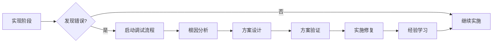

# SDD 错误处理和调试命令模板

## 命令描述
`sdd.debug` - 智能错误处理和根因分析系统

## 功能说明
该命令系统专门解决 AI 编程中的错误处理痛点，通过结构化的方法确保错误得到彻底分析、解决方案得到验证，并建立错误知识库避免重复犯错。

## 错误处理流程设计

### 🚨 错误处理流程图

```mermaid
graph TD
    A[错误发现] --> B[/sdd.debug.init<br/>错误初始化]
    B --> C[/sdd.debug.analyze<br/>根因分析]
    C --> D[/sdd.debug.solutions<br/>方案设计]
    D --> E[/sdd.debug.validate<br/>方案验证]
    E --> F{验证通过?}
    F -->|是| G[/sdd.debug.implement<br/>实施修复]
    F -->|否| C
    G --> H[/sdd.learn<br/>经验学习]
    
    style A fill:#ffebee
    style B fill:#fce4ec
    style C fill:#f3e5f5
    style D fill:#e8f5e8
    style E fill:#e8f4fd
    style F fill:#fff3e0
    style G fill:#e8f5e8
    style H fill:#f1f8e9
```

## 命令详细说明

### 1. `/sdd.debug.init` - 错误初始化
**功能**：系统化记录错误信息，建立错误档案

**使用场景**：
- 发现新错误或异常
- 需要系统化记录错误信息
- 准备进行错误分析

**输入格式**：
```bash
/sdd.debug.init [错误描述]
/sdd.debug.init --type [错误类型] --severity [严重程度] --context [上下文]
```

**示例**：
```bash
/sdd.debug.init 用户登录接口返回500错误，数据库连接超时
/sdd.debug.init --type database --severity high --context production
```

**输出**：
- `debug/[error-id]/error-profile.md` - 错误档案
- 错误分类和标签
- 影响范围评估
- 紧急程度评级

**关键检查项**：
- ✅ 错误现象描述清晰
- ✅ 错误触发条件明确
- ✅ 影响范围评估准确
- ✅ 复现步骤详细

---

### 2. `/sdd.debug.analyze` - 根因分析
**功能**：强制进行深度根因分析，避免急于解决

**使用场景**：
- 需要深入分析错误原因
- 避免表面解决方案
- 建立错误原因链

**输入格式**：
```bash
/sdd.debug.analyze [错误ID]
/sdd.debug.analyze --deep --method 5whys --error-id [ID]
```

**示例**：
```bash
/sdd.debug.analyze ERR20241001
/sdd.debug.analyze --deep --method fishbone --error-id ERR20241001
```

**分析方法**：
- **5 Whys 分析法**：连续追问5个为什么
- **鱼骨图分析**：从人、机、料、法、环、测分析
- **时序分析**：分析事件发生的时间序列
- **对比分析**：对比正常和异常状态

**输出**：
- `debug/[error-id]/root-cause.md` - 根因分析报告
- 错误原因链
- 关键因素识别
- 相关性分析

**防错机制**：
- ❌ 禁止直接跳到解决方案
- ✅ 强制完成根因分析
- 🔍 多角度验证分析结果

---

### 3. `/sdd.debug.solutions` - 方案设计
**功能**：设计多个解决方案，避免重复设计和过度简化

**使用场景**：
- 基于根因分析设计解决方案
- 避免重复已有功能
- 防止过度简化设计

**输入格式**：
```bash
/sdd.debug.solutions [错误ID]
/sdd.debug.solutions --min-options 3 --check-duplicates
```

**示例**：
```bash
/sdd.debug.solutions ERR20241001
/sdd.debug.solutions --min-options 3 --check-duplicates --no-simplification
```

**设计原则**：
- **多方案对比**：至少提供3个解决方案
- **复用检查**：检查是否已有类似功能
- **完整性检查**：确保方案不破坏原有设计
- **复杂度评估**：避免过度复杂的解决方案

**输出**：
- `debug/[error-id]/solutions.md` - 解决方案对比
- 方案优缺点分析
- 实施复杂度评估
- 风险评估矩阵

**防错机制**：
- 🚫 禁止使用模拟数据作为长期方案
- 🚫 禁止过度简化原有设计
- ✅ 强制检查现有代码复用
- ✅ 强制方案对比分析

---

### 4. `/sdd.debug.validate` - 方案验证
**功能**：在实施前验证解决方案有效性

**使用场景**：
- 验证解决方案的有效性
- 测试方案在真实环境的表现
- 确认方案不会引入新问题

**输入格式**：
```bash
/sdd.debug.validate [错误ID] [方案编号]
/sdd.debug.validate --prototype --real-data --no-mock
```

**示例**：
```bash
/sdd.debug.validate ERR20241001 2
/sdd.debug.validate ERR20241001 2 --prototype --real-data --integration-test
```

**验证方法**：
- **原型验证**：小范围原型测试
- **单元测试**：针对性单元测试
- **集成测试**：与现有系统集成测试
- **压力测试**：验证性能影响

**输出**：
- `debug/[error-id]/validation.md` - 验证报告
- 测试结果分析
- 性能影响评估
- 潜在风险识别

**质量门禁**：
- ✅ 测试覆盖率 > 90%
- ✅ 性能影响 < 5%
- ✅ 无新的安全风险
- ✅ 兼容性测试通过

---

### 5. `/sdd.debug.implement` - 实施修复
**功能**：在验证通过后实施解决方案

**使用场景**：
- 实施经过验证的解决方案
- 部署修复到目标环境
- 监控修复效果

**输入格式**：
```bash
/sdd.debug.implement [错误ID] [方案编号]
/sdd.debug.implement --rollback --monitor
```

**示例**：
```bash
/sdd.debug.implement ERR20241001 2
/sdd.debug.implement ERR20241001 2 --rollback --monitor --notify
```

**实施流程**：
- 代码审查和批准
- 渐进式部署
- 实时监控
- 回滚准备

**输出**：
- `debug/[error-id]/implementation.md` - 实施报告
- 部署记录
- 监控数据
- 用户反馈

---

### 6. `/sdd.learn` - 经验学习
**功能**：将错误处理经验纳入知识库，避免重复犯错

**使用场景**：
- 错误解决完成后总结经验
- 建立团队错误知识库
- 预防类似错误再次发生

**输入格式**：
```bash
/sdd.learn [错误ID]
/sdd.learn --extract-patterns --update-guidelines
```

**示例**：
```bash
/sdd.learn ERR20241001
/sdd.learn ERR20241001 --extract-patterns --update-guidelines --team-share
```

**学习内容**：
- **错误模式提取**：识别错误发生的模式
- **解决方案模式**：总结有效的解决方案
- **预防措施**：制定预防类似错误的措施
- **知识更新**：更新开发指南和最佳实践

**输出**：
- `knowledge/patterns/[pattern-id].md` - 错误模式文档
- `knowledge/solutions/[solution-id].md` - 解决方案模板
- 更新的开发指南
- 团队培训材料

## 历史记录和重复检测机制

### 🧠 智能历史记录
```bash
# 记录所有尝试过的思路
/sdd.debug.history --record "尝试使用缓存解决数据库问题"
/sdd.debug.history --record "缓存方案导致数据一致性问题"

# 检测重复思路
/sdd.debug.history --check "使用缓存解决数据库问题"
# 输出：⚠️ 该思路在 2024-09-15 已尝试，结果：数据一致性问题
```

### 🔄 失败思路提醒
当 AI 提出之前失败的解决方案时：
```
🚨 历史提醒：该解决方案已于 2024-09-15 尝试失败
- 失败原因：数据一致性问题  
- 错误ID：ERR20240915
- 建议：考虑其他方案或解决一致性问题
```

### 📊 错误模式分析
```bash
/sdd.debug.patterns --analyze --category database
# 输出：数据库连接错误的常见模式和解决方案
```

## 质量保证和防错机制

### 🛡️ 强制检查点
1. **根因分析完成检查**：必须完成深度分析才能进入方案设计
2. **多方案要求**：必须提供至少3个解决方案
3. **复用检查**：强制检查现有代码复用可能性
4. **验证门禁**：必须通过验证才能实施
5. **学习要求**：必须完成经验总结才能关闭错误

### 🚫 禁止行为检测
- ❌ 直接跳到解决方案（跳过根因分析）
- ❌ 使用模拟数据作为最终方案
- ❌ 重复实现已有功能
- ❌ 过度简化导致功能缺失
- ❌ 忽略历史失败教训

## 使用示例：完整错误处理流程

```bash
# 1. 发现错误
/sdd.debug.init --type database --severity high "用户登录接口超时"

# 2. 深度分析根因
/sdd.debug.analyze --method 5whys ERR20241020

# 3. 设计多个解决方案
/sdd.debug.solutions --min-options 3 --check-duplicates ERR20241020

# 4. 验证最佳方案
/sdd.debug.validate --prototype --real-data ERR20241020 2

# 5. 实施修复
/sdd.debug.implement --rollback --monitor ERR20241020 2

# 6. 学习和总结
/sdd.learn --extract-patterns --update-guidelines ERR20241020
```

## 集成到 SDD 主流程

在原有的 SDD 流程中，错误处理作为并行的质量保证机制：



---

**注意**: 该命令系统专门针对 AI 编程中的错误处理问题设计，通过结构化流程和智能提醒机制，显著提高错误处理质量和效率。