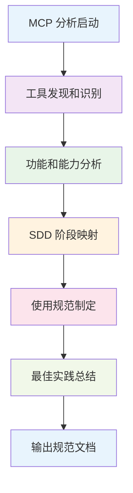

# SDD MCP 分析命令模板

## 命令描述
`sdd.mcp` - MCP 服务器分析和使用规范生成器

## 功能说明
该命令用于分析当前环境中所有可用的 MCP (Model Context Protocol) 服务器，按照 SDD 范式的规范和流程，生成标准化的 MCP 使用规范，确保在开发过程中能够有效利用 MCP 工具提高开发质量��

## 🎯 核心价值

### 解决的问题
- **工具使用混乱**：缺乏统一的 MCP 工具使用标准
- **信息获取不准确**：没有规范的工具选择和使用流程
- **效率低下**：重复研究相同的工具和文档
- **质量不一致**：不同开发阶段使用工具的方式不统一

### 预期效果
- **工具使用标准化**：建立统一的 MCP 工具使��规范
- **信息获取准确化**：确保选择最合适的技术文档和工具
- **开发效率提升**：避免重复研究，快速获取准确信息
- **质量保证增强**：在合适的开发阶段使用合适的工具

## 🔄 MCP 分析工作流程



## 📋 命令使用格式

### 基础用法
```bash
/sdd.mcp
```

### 带参数用法
```bash
/sdd.mcp --category all
/sdd.mcp --phase planning
/sdd.mcp --tool context7
/sdd.mcp --format detailed
```

### 参数说明
- `--category`: 工具类别过滤 (all|documentation|testing|analysis|automation)
- `--phase`: 针对 SDD 特定阶段 (init|specify|plan|tasks|implement|validate)
- `--tool`: 特定工具的深度分析
- `--format`: 输出格式 (summary|detailed|template)

## 🔍 MCP 分析流程

### 第一步：工具发现和识别
**目标**：识别当前环境中所有可用的 MCP 服务器

**分析内容**：
- 扫描所有以 `mcp__` 开头的工具
- 识别工具的提供者和主要功能
- 分析工具的稳定性和可靠性
- 评估工具与当前项目的相关性

**输出**：
- MCP 服务器清单
- 工具分类和优先级
- 工具可靠性评估

### 第二步：功能和能力分析
**目标**：深入分析每个 MCP 工具的功能和适用场景

**分析维度**：
- **核心功能**：工具的主要用途和能力
- **适用场景**：最合适的使用场景
- **限制和约束**：工具的使用限制
- **数据格式**：输入输出数据格式要求
- **性能特征**：响应时间、稳定性等

**分析标准**：
- 功能完整性评分
- 易用性评分
- 可靠性评分
- 项目相关性评分

### 第三步：SDD 阶段映射
**目标**：将 MCP 工具映射到 SDD 的各个阶段

**映射原则**：
- **工具能力匹配**：工具功能与阶段需求的匹配度
- **信息质量要求**：阶段对信息准确性的要求
- **效率考虑**：工具使用的效率影响
- **质量保证**：工具对质量提升的贡献

**映射结果**：
- 每个阶段推荐使用的工具
- 工具使用的优先级
- 工具组合使用策略

### 第四步：使用规范制定
**目标**：制定标准化的工具使用规范

**规范内容**：
- **使用时机**：何时使用特定工具
- **使用方法**：标准的工具调用方式
- **输出格式**：期望的输出结果格式
- **质量标准**：工具使用的质量要求
- **异常处理**：工具使用异常的处理方式

### 第五步：最佳实践总结
**目标**：总结工具使用的最佳实践和经验教训

**总结内容**：
- **成功案例**：工具使用的成功经验
- **常见问题**：工具使用中的常见问题和解决方案
- **效率技巧**：提高工具使用效率的技巧
- **质量保证**：确保工具输出质量的措施

## 📊 MCP 服务器分类框架

### 1. 文档查询类 (Documentation)
**特征**：用于获取技术文档、API 参考、最佳实践
**典型工具**：Context7, Deep Wiki
**适用阶段**：Constitution, Specify, Plan
**使用规范**：
- 在技术选型时优先使用
- 获取官方文档和权威信息
- 验证技术方案的可行性

### 2. 代码分析类 (Analysis)
**特征**：用于代码质量分析、问题诊断、性能评估
**典型工具**：IDE Diagnostics
**适用阶段**：Plan, Tasks, Implement, Validate
**使用规范**：
- 在代码质量检查时使用
- 识别技术债务和改进点
- 验证实现质量

### 3. 测试验证类 (Testing)
**特征**：用于功能测试、性能测试、自动化验证
**典型工具**：Playwright
**适用阶段**：Implement, Validate
**使用规范**：
- 在功能验证时使用
- 进行端到端测试
- 验证用户体验

### 4. 自动化类 (Automation)
**特征**：用于自动化开发流程、重复性任务
**典型工具**：Task Agents, File Operations
**适用阶段**：All phases
**使用规范**：
- 自动化重复性工作
- 提高开发效率
- 确保流程一致性

## 🎯 输出文档结构

### 主文档：mcp-usage-specification.md
```markdown
# SDD MCP 使用规范

## 1. 概述
- MCP 工具总览
- 使用原则和标准
- 质量要求

## 2. MCP 服务器详细分析
- 每个工具的详细分析
- 功能描述和适用场景
- 使用方法和最佳实践

## 3. SDD 阶段使用映射
- 各阶段推荐工具
- 使用时机和方法
- 质量检查点

## 4. 使用模板
- 各阶段的标准使用模板
- Claude 指令模板
- 输出格式要求

## 5. 最佳实践
- 成功案例和经验
- 常见问题和解决方案
- 效率提升技巧

## 6. 附录
- 工具参考文档
- 故障排除指南
- 更新日志
```

### 子文档：mcp-templates.md
```markdown
# SDD MCP 使用模板

## 项目初始化模板
## 功能规范模板
## 技术设计模板
## 错误处理模板
## 验收测试模板
```

## 🔧 实施细节

### 工具发现算法
```python
# 伪代码：MCP 工具发现
def discover_mcp_tools():
    mcp_tools = []
    for tool in available_tools:
        if tool.name.startswith('mcp__'):
            mcp_tools.append({
                'name': tool.name,
                'provider': extract_provider(tool.name),
                'functions': tool.functions,
                'description': tool.description
            })
    return categorize_tools(mcp_tools)
```

### 质量评估标准
```yaml
quality_metrics:
  functionality:
    weight: 0.4
    criteria: [completeness, accuracy, relevance]
  usability:
    weight: 0.3
    criteria: [ease_of_use, learning_curve, documentation]
  reliability:
    weight: 0.3
    criteria: [stability, error_handling, performance]
```

### SDD 阶段映射矩阵
```yaml
phase_mapping:
  constitution:
    primary: [documentation]
    secondary: [analysis]
    tools: [context7, deepwiki]
  
  specify:
    primary: [documentation, automation]
    secondary: [analysis]
    tools: [context7, deepwiki, task]
  
  plan:
    primary: [documentation, analysis]
    secondary: [testing]
    tools: [context7, ide, playwright]
  
  implement:
    primary: [analysis, testing, automation]
    secondary: [documentation]
    tools: [ide, playwright, task]
  
  validate:
    primary: [testing, analysis]
    secondary: [documentation]
    tools: [playwright, ide, context7]
```

## 🎯 使用示例

### 示例1：完整分析
```bash
/sdd.mcp
```
**预期输出**：完整的 MCP 使用规范文档

### 示例2：针对特定阶段
```bash
/sdd.mcp --phase planning
```
**预期输出**：规划阶段的 MCP 工具使用指南

### 示例3：特定工具深度分析
```bash
/sdd.mcp --tool context7 --format detailed
```
**预期输出**：Context7 工具的详细使用指南

## 📈 预期效益

### 短期效益
- **工具使用标准化**：建立统一的工具使用规范
- **信息获取效率提升**：快速找到合适的工具和方法
- **开发质量改善**：在合适的阶段使用合适的工具

### 长期效益
- **知识积累**：建立工具使用的知识库
- **流程优化**：持续改进工具使用流程
- **团队协作改善**：统一的工具使用标准

## 🔄 更新和维护

### 定期更新
- **每月**：检查新工具和工具更新
- **每季度**：评估工具使用效果
- **每年**：更新使用规范和最佳实践

### 维护流程
1. **工具监控**：监控新工具的出现和现有工具的更新
2. **效果评估**：评估工具使用的效果和影响
3. **规范更新**：根据评估结果更新使用规范
4. **团队培训**：培训团队使用新的规范和工具

---

**注意**：该命令的输出应该是一个完整、实用的 MCP 使用规范文档，能够在实际开发中指导团队正确使用 MCP 工具。