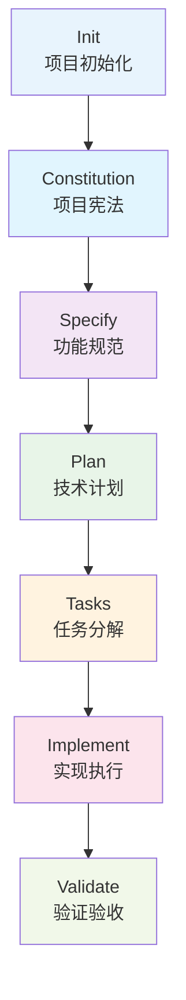
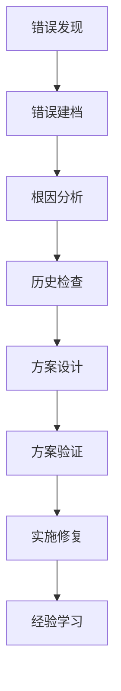

# 规范驱动开发（SDD）完整指南

## 🎯 核心理念

**规范驱动开发（Spec-Driven Development, SDD）**是一种将软件开发流程从"代码优先"转变为"规范优先"的方法论。在 SDD 中：

- **传统开发**：代码是真理，规范服务于代码
- **SDD 开发**：规范是真理，代码服务于规范

## 🔄 核心工作流程

SDD 包含 7 个核心阶段，每个阶段都有明确的输入、输出和验收标准：



**新增阶段说明**：
- **Init（项目初始化）**：针对现有项目的技术栈分析和 SDD 范式初始化，是新加入的关键阶段，使 SDD 能够无缝集成到现有项目中。

## 📋 阶段详细说明

### 阶段 1: Init（项目初始化）
**目标**：分析现有项目的技术栈、架构模式和开发规范，生成适合该项目的 SDD 配置

**适用场景**：
- 现有项目需要引入 SDD 范式
- 需要为现有代码库制定开发规范
- 技术栈迁移和架构优化
- 团队开发流程标准化

**输入**：
- 现有项目源代码
- 配置文件（package.json, tsconfig.json 等）
- 项目目录结构
- 已有的开发文档

**输出**：
- `tech-stack-analysis.md` - 技术栈分析报告
- `CONSTITUTION.md` - 基于现有技术栈的项目宪法
- `integration-guide.md` - SDD 集成建议
- `team-training-plan.md` - 团队培训计划

**关键活动**：
- 自动识别项目框架和技术栈
- 分析代码质量和架构模式
- 评估现有开发规范
- 生成定制化的 SDD 配置
- 制定渐进式迁移策略

**验收标准**：
- ✅ 技术栈识别准确率 > 95%
- ✅ 生成的宪法符合项目实际
- ✅ 集成建议具有可操作性
- ✅ 团队培训计划切实可行

**质量保证**：
- 技术栈完整性检查
- 代码规范一致性验证
- 生成的配置合理性评估

---

### 阶段 2: Constitution（项目宪法）
**目标**：建立项目的治理原则和开发准则

**输入**：
- 项目愿景和目标
- 技术栈偏好
- 团队价值观

**输出**：
- `CONSTITUTION.md` - 项目宪法文档
- 核心原则列表
- 开发约束条件

**关键问题**：
- 我们项目的核心价值是什么？
- 哪些技术选择是不可妥协的？
- 我们如何衡量代码质量？

### 阶段 3: Specify（功能规范）
**目标**：将模糊需求转换为精确、可测试的功能规范

**输入**：
- 用户需求描述
- 项目宪法约束
- 业务上下文

**输出**：
- `specs/[feature-name]/spec.md` - 功能规范文档
- 用户故事和验收标准
- 成功指标定义

**关键原则**：
- ✅ 专注于 **WHAT** 和 **WHY**
- ❌ 避免 **HOW**（技术实现细节）
- 🎯 面向业务相关方，而非开发者

### 阶段 4: Plan（技术计划）
**目标**：将功能规范转换为详细的技术实现方案

**输入**：
- 功能规范文档
- 项目宪法
- 技术栈约束

**输出**：
- `specs/[feature-name]/plan.md` - 技术实现计划
- `data-model.md` - 数据模型设计
- `contracts/` - API 契约定义
- `research.md` - 技术调研结果

**关键活动**：
- 技术选型和架构设计
- 数据模型设计
- API 接口定义
- 风险评估和缓解方案

### 阶段 5: Tasks（任务分解）
**目标**：将技术计划分解为可执行、可验证的任务列表

**输入**：
- 技术实现计划
- 数据模型和API契约
- 调研结果

**输出**：
- `specs/[feature-name]/tasks.md` - 任务清单
- 依赖关系图
- 并行执行策略

**任务组织原则**：
- 按用户故事分组
- 明确依赖关系
- 支持并行开发
- 每个任务都有明确的验收标准

### 阶段 6: Implement（实现执行）
**目标**：按照任务清单执行开发工作

**输入**：
- 任务清单
- 技术计划
- 设计文档

**输出**：
- 完整的功能实现
- 测试用例
- 部署配置

**执行原则**：
- 按阶段顺序执行
- 尊重依赖关系
- 持续验证和反馈
- 及时更新进度

### 阶段 7: Validate（验证验收）
**目标**：确保实现结果符合规范和计划

**输入**：
- 实现的功能
- 原始规范
- 验收标准

**输出**：
- 验收报告
- 问题清单
- 改进建议

## 🎯 质量保证机制

### 澄清机制（Clarify）
在规范制定过程中，主动识别和澄清模糊点：

```
[NEEDS CLARIFICATION: 具体问题]
```

### 分析机制（Analyze）
跨工件一致性检查：
- 规范与计划的一致性
- 计划与任务的一致性
- 实现与规范的一致性

### 检查清单机制（Checklist）
为每个阶段生成质量检查清单：
- 需求完整性检查
- 设计一致性检查
- 实现质量检查

### 🚨 错误处理机制（Debug）
智能错误处理和调试系统，专门解决 AI 编程中的错误处理痛点：

#### 🔄 错误处理工作流


#### 🎯 解决的四大核心问题
1. **急于解决错误而不是分析原因**
   - **强制根因分析**：使用 `/sdd.debug.analyze` 必须完成深度分析
   - **多方法验证**：5 Whys、鱼骨图、时序分析、对比分析

2. **重复设计类似的模块和代码**
   - **智能历史检查**：使用 `/sdd.history.check` 避免重复思路
   - **功能复用检测**：自动检查是否已有类似功能

3. **采用模拟数据或简化原有设计**
   - **严格验证机制**：使用 `/sdd.debug.validate` 禁止模拟数据
   - **完整性检查**：确保方案不破坏原有设计

4. **出现过的思路会被遗忘**
   - **知识库系统**：使用 `/sdd.learn` 永不遗忘失败教训
   - **智能提醒**：自动检测重复的失败思路

#### 🛡️ 防错机制
- **强制分析**：不允许跳过根因分析
- **多方案要求**：必须提供至少3个解决方案
- **历史提醒**：自动检测重复失败思路
- **质量门禁**：不通过验证不允许实施
- **真实验证**：禁止使用模拟数据作为最终方案

## 🚀 实施策略

### 现有项目集成策略

#### 🎯 初始化优先
对于现有���目，强烈建议从 **Init 阶段**开始：
```bash
# 第一步：分析现有项目
/sdd.init --framework [现有框架] --team-size [团队规模]
```

**Init 阶段的价值**：
- 自动识别技术栈和架构模式
- 生成符合项目实际的项目宪法
- 提供切实可行的集成建议
- 制定定制化的培训计划

#### 🔄 渐进式采用路径

**第一阶段：基础规范建立**（1-2周）
- 执行 `/sdd.init` 进行项目分析
- 使用 `/sdd.constitution` 建立项目规范
- 采用 `/sdd.specify` 制定功能规范
- 使用 `/sdd.plan` 设计技术方案
- **重点**：建立规范意识，培养制定规范的习惯

**第二阶段：任务管理和执行**（2-3周）
- 引入 `/sdd.tasks` 进行任务分解
- 执行 `/sdd.implement` 按任务实施
- 使用 `/sdd.clarify` 解决模糊问题
- **重点**：提升任务管理能力和执行效率

**第三阶段：质量保证完善**（1-2周）
- 全面使用 `/sdd.analyze` 进行质量分析
- 采用 `/sdd.checklist` 建立检查清单
- 建立持续改进机制
- **重点**：构建完整的质量保证体系

**第四阶段：持续优化**（长期）
- 定期更新和优化规范
- 根据项目特点调整流程
- 建立团队知识库
- **重点**：形成符合团队特点的 SDD 实践

### 团队协作

#### 🎯 角色分工（更新版）
- **项目经理/产品经理**：主导 **Init**、**Constitution** 和 **Specify** 阶段
- **技术负责人**：主导 **Plan** 和 **Tasks** 阶段
- **开发团队**：主导 **Implement** 阶段，参与其他阶段
- **质量保证**：主导 **Validate** 阶段，协助质量门禁建立
- **DevOps 工程师**：支持工具链配置和自动化流程

#### 🔄 协作机制
- **阶段交接**：每个阶段结束前进行交接会议
- **质量门禁**：阶段间的质量检查和验收
- **知识共享**：定期的 SDD 实践分享会
- **持续改进**：基于反馈的流程优化

### 工具支持
- 文档模板：确保结构一致性
- 自动化脚本：减少重复工作
- 版本控制：追踪变更历史
- 协作平台：促进团队沟通

## 📊 成功指标

### 效率指标
- 需求澄清时间减少 50%
- 返工率降低 70%
- 交付周期可预测性提升 80%

### 质量指标
- 功能完整性达到 95%
- 代码一致性提升 90%
- 文档覆盖率 100%

### 团队满意度
- 需求理解清晰度提升
- 开发目标明确性增强
- 跨职能协作改善

## 🔄 持续改进

### 反馈循环
1. **收集反馈**：每个阶段结束后收集团队反馈
2. **分析问题**：识别流程瓶颈和改进机会
3. **实施改进**：调整模板和流程
4. **验证效果**：评估改进效果

### 模板演进
- 定期更新模板以反映最佳实践
- 根据项目特点定制模板
- 保持模板的简洁性和实用性

## 🎖️ 最佳实践

### 🚀 项目初始化最佳实践
- **现有项目优先使用 `/sdd.init`** - 自动分析技术栈，生成定制配置
- **明确项目类型和规模** - 选择合适的质量等级和团队配置
- **建立基线指标** - 记录当前的开发效率和质量数据
- **制定培训计划** - 确保团队理解 SDD 核心理念

### 📋 规范制定最佳实践
- **使用用户故事格式** - 确保需求描述清晰易懂
- **明确定义验收标准** - 每个功能都有可衡量的完成标准
- **识别边界条件和异常情况** - 提高需求完整性
- **业务语言优先** - 规范面向业务相关方，而非技术实现
- **持续澄清** - 使用 `/sdd.clarify` 主动解决模糊点

### 🛠️ 技术设计最佳实践
- **考虑可扩展性和维护性** - 长期视角的技术选型
- **评估技术风险** - 识别潜在的技术债务和风险点
- **记录设计决策理由** - 便于后续回顾和优化
- **架构一致性** - 与现有技术栈保持协调
- **安全优先** - 在设计阶段考虑安全要求

### 📝 任务管理最佳实践
- **保持任务粒度适中** - 1-3天的工作量为宜
- **明确任务依赖关系** - 支持并行开发
- **定义完成标准** - 每个任务都有清晰的验收条件
- **任务可追踪** - 使用 `/sdd.tasks` 生成可执行的任务清单
- **进度可视化** - 及时更新任务状态

### ✅ 质量保证最佳实践
- **建立多层次的检查机制** - 阶段检查 + 最终验收
- **自动化重复性检查** - 使用 `/sdd.analyze` 和 `/sdd.checklist`
- **持续监控质量指标** - 跟踪关键性能指标
- **质量门禁制度** - 不达标不进入下一阶段
- **根因分析** - 对质量问题进行深度分析

### 🔄 持续改进最佳实践
- **定期回顾** - 每月进行 SDD 实践回顾
- **模板优化** - 根据项目特点调整模板
- **知识沉淀** - 建立团队 SDD 知识库
- **经验分享** - 定期分享成功案例和教训
- **工具迭代** - 持续改进 SDD 工具链

---

## 🎉 总结

这套 **SDD 方法论**（含新增的 Init 阶段）旨在帮助团队建立规范、高效、可预测的软件开发流程。通过将规范提升为核心工件，我们可以显著减少沟通成本、降低返工率，并提高交付质量。

### 🔑 核心价值
- **规范优先**：从"代码优先"转向"规范优先"的开发理念
- **智能初始化**：通过 `/sdd.init` 实现现有项目的无缝集成
- **质量可控**：系统化的质量保证机制和检查清单
- **团队协作**：明确的角色分工和协作机制
- **持续改进**：基于反馈的流程优化和工具迭代

### 🚀 立即开始
1. **现有项目**：执行 `/sdd.init` 开始您的 SDD 之旅
2. **新项目**：从 `/sdd.constitution` 开始建立项目规范
3. **团队培训**：参考渐进式采用策略，分阶段引入 SDD

**通过 SDD 范式，让每一个开发决策都有据可依，每一个交付质量都有迹可循。**